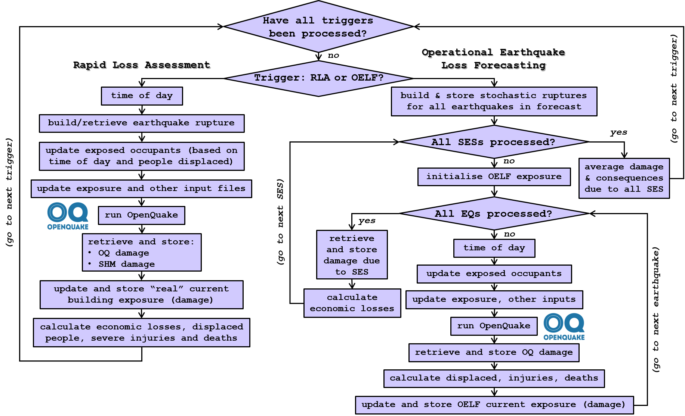

# The Real-Time Loss Tools: Overview

The Real-Time Loss Tools carry out rapid loss assessments (RLA) and event-based operational
earthquake loss forecasts (OELF) incorporating probabilities of damage states based on
structural health monitoring (SHM) methods, calculating cumulative damage, expected economic
losses and human casualties (injuries and deaths) and updating the number of occupants in the
buildings, by taking into account the time of the day of the earthquake as well as whether
people are allowed back (due to inspection and repair times) and are able to do so (due to their
own health status). The tools recursively call the
[OpenQuake engine](https://github.com/gem/oq-engine) (Pagani et al., 2014; Silva et al., 2014)
and update the exposure model and other relevant input files. They have been designed to work
with v3.15 of the OpenQuake engine.

## General workflow

The running of the Real-Time Loss Tools is controlled by three main files: the `config.yml`
configuration file, the `triggering.csv` file and the `job.ini` file for OpenQuake. The contents
and formats of all these are explained [here](02_Configuration.md). What is most relevant to
understand the general workflow is the `triggering.csv` file, which is used to simulate the
triggering of a RLA when an earthquake of interest occurs and an OELF when a forecast of
seismicity becomes available. As shown in Fig. 1.1 below, the Real-Time Loss Tools go one by one
through each of the triggers in the `triggering.csv` file and run a RLA or OELF calculation as 
indicated therein. 



Figure 1.1 Schematic overview of the processing algorithm.

Many of the steps followed for each earthquake are common to both the RLA and OELF routines.
These include:
- Conversion of the UTC time of occurrence of the earthquake into local time (the time zone is
defined in the configuration file). This is used to classify the time of the day (day, night,
transit times), which is needed to define the number of occupants in the buildings.
- Determination of the number of occupants as a function of the time of the day, the time
elapsed with respect to previous damaging earthquakes (with respect to the mean number of days
needed to inspect and repair buildings, as well as the mean number of days people are expected
to remain in hospital due to the severity of their injuries, all of which are specified by the
user), and the number of people injured or deceased during previous earthquakes.
- Updating of the "current" exposure CSV file with the number of occupants (though this
"current" file is different for RLA and OELF, see comments below).
- Updating of `current/exposure_model.xml` and `current/job.ini` with the time of the day, the
description of the calculation, etc.
- Running a scenario damage calculation with OpenQuake and retrieving the damage results.
- Updating the exposure model with the newly-calculated damage states and distributing the
replacement costs and number of census occupants proportionally.
- Calculating injuries/deaths and storing the resulting timelines that indicate when (in UTC
terms) people are allowed to go back to buildings with different levels of damage and how many
people cannot go back to buildings due to their own health condition.

While RLA calculations always update the `exposure_model_current.csv` file under the `current`
folder, because they correspond to earthquakes that have actually occurred, the OELF
calculations initialise the exposure model before running each stochastic event set (i.e., each
realisation of seismicity), taking the current “real” exposure as a starting point (i.e., the
`current/exposure_model_current.csv` file), as they correspond to seismicity forecasts that may
or may not occur.

Both RLA and OELF calculations require rupture XML files for each earthquake.
In the case of OELF, a seismicity forecast is input by the user with a list of realisations of
seismicity (referred to as "stochastic event sets", SES, following the nomenclature used in
OpenQuake), each of which contains a number of earthquakes defined, at least, by their
epicentre, magnitude, date/time of occurrence and the SES they belong to. The Real-Time Loss
Tools first identify all earthquakes with magnitude equal to or larger than a threshold as well
as within a maximum epicentral distance from the input exposure model, all these defined as
input by the user. Then the tools use a stochastic rupture generator to build ruptures
associated with each of these earthquakes based on an input model of uniform area sources
(provided by the user in the OpenQuake seismogenic source model XML format), starting by
sampling the hypocentral depth (if not provided in the seismicity forecast) and then the rupture
nodal properties. All other earthquakes in the seismicity forecast that are filtered out due to
the minimum magnitude and/or maximum distance criteria are assumed to not cause any change in
the damage state of the buildings.

In the case of RLA, the user can provide either a rupture XML file in the OpenQuake format or
a series of rupture parameters by means of a CSV file, which are used by the Real-Time Loss
Tools to generate the corresponding rupture XML file. The choice can be different for different
RLA earthquakes in the `triggering.csv` file. The current version of the Real-Time Loss Tools
can only generate ruptures for normal faults in the form of simple planar ruptures and requires
that rupture parameters be input by the user in the form of a CSV file whose contents and
formats are described [here](03_Input.md#rupture-parameters-for-rla). The advantage of providing
rupture XML files directly as input is that any kind of rupture supported by OpenQuake can be
used.

As shown in Fig. 1.1 above, the stage of retrieval and storage of damage states differs slightly
for RLA and OELF calculations as well, as externally-derived probabilities of damage states can
be input for RLA calculations. Within the context of the RISE project these externally-derived
damage assessments are intended to stem from structural health monitoring (SHM) techniques, but
damage probabilities from other sources can be input as well. The damage probabilities specified
under `shm/damage_results_shm.csv` override those calculated by OpenQuake (for the
`building_id`s for which they are specified). The OELF calculations do not consider external
estimates of damage.

In the case of RLA, the economic losses are calculated straightaway at the end of the process,
once the exposure model has been updated to reflect the newly-calculated damage states. In the
case of OELF, however, the economic losses are not calculated after each earthquake but at the
end of each stochastic event set (SES), as shown in Fig. 1.1, as economic losses depend only on
the final damage state at the end of the SES.

## Keeping track of damage states

In order to keep track of damage states, the Real-Time Loss Tools update the exposure model
after each run and concatenate the string describing the building class of each asset with the
corresponding damage state. If the initial condition of all buildings is undamaged, then all
building classes in the initial exposure model end in `/DS0` or similar (the naming of the
damage states is user-defined). Once damage occurs during the calculation, the original
undamaged entries of the exposure model get split into all resulting damage states, and this
happens once and again after each earthquake is run.

The Real-Time Loss Tools use the following concepts to work with exposure models that keep track
of their damage states:
- `building_id`: It can refer to an individual building or an aggregated group of buildings
(placed in the same location for calculation purposes), and it is associated with the resolution
of the exposure model.
- `original_asset_id`: It corresponds to a specific combination of a `building_id` and a
building class (i.e., type of structure), in the initial damage state input by the user.
- `asset_id`: It refers to a specific combination of `building_id`, `original_asset_id` and
damage state, and is the equivalent of OpenQuake’s asset (i.e., each row of the exposure CSV
file). 

When the `building_id` refers to an individual building, the values assigned to each `asset_id`
after each earthquake are the probabilities of the damage states (combined with the
probabilities of each building class, that is, each `original_asset_id`). When the `building_id`
refers to an aggregate number of buildings, the values assigned to each `asset_id` after each
earthquake are the number of buildings of a specific building class (each `original_asset_id`)
in a specific damage state.

As shown in Fig. 1.2 below, the Real-Time Loss Tools group entries of the exposure model that
correspond to the same damage state of the same `building_id` and `original_asset_id`,
irrespective of how the building got to that damage state.


Figure 1.2 Example of the updating of damage states in the exposure model for one `building_id`
with buildings of two different classes (two different `original_asset_id`s).

## Updating the number of occupants

The number of occupants of buildings is updated right before running a new calculation, as it
depends on the date and time of the "current" earthquake because:
- different factors are defined for different times of the day (day, night, transit),
acknowledging that people usually move across different buildings for their daily activities,
- the time elapsed from the last earthquake is relevant to know whether people will be allowed
back into buildings (or they are still being inspected or repaired), and
- the time elapsed from the previous earthquakes is relevant to know whether injured people are
expected to still be in hospital.

When a RLA or a damage assessment due to one earthquake within an OELF calculation is carried
out, two timelines of future occupancy are calculated based on the mean number of days expected
to be needed for inspection/repair of buildings and recovery of people in hospital (all these
are user-specified parameters). The timeline of number of people “still away” due to their own
health status is calculated per earthquake and per `original_asset_id`, and is stored as an
individual CSV file. The timeline of permission to go back into buildings is calculated per
earthquake and per damage state, and is also stored as an individual CSV file. Both timelines
are stored in terms of UTC, so that the UTC date and time of the new earthquake can be directly
compared against the previously-stored timelines.

When a new earthquake calculation begins, the previous timelines are sought and the number of
current occupants for each `original_asset_id` is calculated as:

```math
occupants_{current} = F_{time\:of\:day} \times F_{occupancy} \times [census_{original} - still\:away]
```

where:

- $`F_{time\:of\:day}`$: factor associated with the day, night or transit times of the day,
- $`F_{occupancy}`$: 0 (currently usable) or 1 (currently unusable) binary factor that depends on
the current damage state of the building,
- $`census_{original}`$: number of census occupants,
- $`still\:away`$: number of people whose health status does not allow them to return to the
building.

## Cumulative damage: state-dependent vs state-independent fragility models

The calculation of damage that accumulates due to a succession of events affecting the same
buildings in short succession requires that state-dependent fragility models be derived. Such
models describe the probability of exceeding different damage states not only as a function of
the ground motion intensity but also the current damage state of the structure.

While the Real-Time Loss Tools were conceived to be used with state-dependent fragility models,
these do not always exist for all building classes that the user might be interested in
analysing. This fact, together with an interest to facilitate the scientific exploration of the
relevance of state-dependent models and accounting for the accumulation of damage during seismic
sequences, led to the incorporation to the Real-Time Loss Tools of the possibility to use
state-independent fragility models to approximate a cumulative damage calculation.

When state-dependent fragility models are used, the probabilities of the different damage states
that are obtained from earthquake _n_ occurring are already cumulative, as the damage state of
the structure at the time that earthquake _n_ hits is accounted for in the state-dependent
fragility model itself. However, when using state-independent fragility models, the
probabilities of occurrence of each damage grade are due _only_ to that one earthquake _n_. The
Real-Time Loss Tools then work under the premise that for a damage state to not be exceeded
after earthquake _n_ it needs to not have been exceeded during any of the previous events, and
for each of the previous events there is a corresponding probability.

After any earthquake _n_ in the sequence, the probability of not exceeding damage state _k_ is
thus calculated as:

```math
PoNE_{cumulative_n}(DS=k) = \prod\limits_{i=1}^n PoNE_{individual_i}(DS=k) = \prod\limits_{i=1}^n [1 - PoE_{individual_i}(DS=k)]
```

where `PoE` and `PoNE` are probability of exceedance and non-exceedance, respectively,
`individual` refers to the probabilities obtained from the state-independent fragility models
for each individual earthquake, and `cumulative` refers to the effect of all earthquakes that
have occurred up to the current one whose consequences are being calculated.

The probability of exceeding damage state _k_ after earthquake _n_ is simply calculated as:

```math
PoE_{cumulative_n}(DS=k) = 1 - PoNE_{cumulative_n}(DS=k)
```

The probability of occurrence of each damage grade is then calculated as usual as the difference
between probabilities of exceedance of incrementally increasing damage states.

As the Real-Time Loss Tools will still look for fragility models conditional on the current
damage state of the structure (which is represented by strings such as `CLASS_A/DS0`,
`CLASS_A/DS1` and so on, as shown in Fig. 1.2), in order to be able to use state-independent
fragility models the user needs to either:
- use the exposure-vulnerability mapping CSV file to direct all structures in all damage states
to their corresponding no-damage fragility models, or
- define the fragility XML file so that entries exist for all structures in all damage states,
but actually input the same state-independent model for all damage states of the same building
class.

More details on the use of the exposure-vulnerability mapping and the fragility XML file can be
found [here](03_Input.md#fragility-models).

The inclusion of this functionality in the Real-Time Loss Tools is not to be interpreted as an
encouragement or an endorsement of the approximation of cumulative damage calculations using
state-independent fragility models. The use of state-dependent fragility models will always be
the appropriate approach.

Once the cumulative probabilities of occurrence have been calculated by means of the procedure
just described, the workflow of the calculation continues to be the same as for the case of
state-dependent fragility models. In reference to Fig. 1.1 above, this procedure belongs to the
step of updating and storing the building exposure to reflect the current damage state of
buildings.

Whether the Real-Time Loss Tools carry out the calculation described herein or assume that the
input fragility models already result in cumulative damage results is controlled by the
[state_dependent_fragilities](02_Configuration.md#state_dependent_fragilities) parameter in the
`config.yml` file.

## Catching OpenQuake runtime errors

The Real-Time Loss Tools attempt to either prevent or work around the occurrence of certain
potential `OpenQuake` runtime errors. These are:
- OpenQuake (up to v 3.15) does not run when all the assets in the exposure model are further
away from the earthquake than the `maximum_distance` parameter in the `job.ini` file. In order
to avoid this from happening, the `max_distance` parameter in the `config.yml` file is used by
the Real-Time Loss Tools to filter out earthquakes from the seismicity forecasts that would
cause OpenQuake to crash. These earthquakes are treated as not generating any additional damage
to the building stock. The `max_distance` parameter in the `config.yml` file should be equal to
or smaller than the `maximum_distance` parameter in the `job.ini` file for this to work well.
- OpenQuake (up to v 3.15) raises a `RuntimeError` when all calculated ground motions are too
weak (e.g., when compared against the `minimum_intensity` threshold, see
[here](https://github.com/gem/oq-engine/blob/v3.15.0/openquake/calculators/event_based.py#L454)).
The Real-Time Loss Tools use `try-except` to return the same damage states as before this
particular earthquake if this `RuntimeError` is raised.
- The Real-Time Loss Tools use OpenQuake's
[DataStore class](https://github.com/gem/oq-engine/blob/v3.15.0/openquake/commonlib/datastore.py#L149)
to open the results from OpenQuake's damage calculations. OpenQuake's
[DataStore.read_df()](https://github.com/gem/oq-engine/blob/v3.15.0/openquake/commonlib/datastore.py#L427)
method raises a `KeyError` when the output does not exist, leading to the error message `There
is no damage, perhaps the hazard is too small?`. The Real-Time Loss Tools use `try-except` to
return the same damage states as before this particular earthquake if this `KeyError` is raised.

In these last two cases, if the calculation is a RLA and the user has input SHM-derived damage
probabilities for the earthquake, the Real-Time Loss Tools will still take these SHM-derived
damage results.

All these OpenQuake errors are visible to the user in the running log of the Real-Time Loss
Tools (which includes all of the log from OpenQuake).

If OpenQuake crashes in a fashion unforeseen by the Real-Time Loss Tools, the Real-Time Loss
Tools crash with the message `OpenQuake has crashed for (earthquake description) and Real-Time
Loss Tools have not been able to solve it`.

It is noted that these errors raised by OpenQuake make full sense in the context of running
OpenQuake's scenario damage calculator for individual earthquakes (as it is designed to be used)
but need to be caught by the Real-Time Loss Tools to avoid relatively long calculations from
crashing due mostly to small and/or distant earthquakes being present in the input OELF
seismicity forecasts or even the RLA triggers.

Return to [documentation index](README.md).
